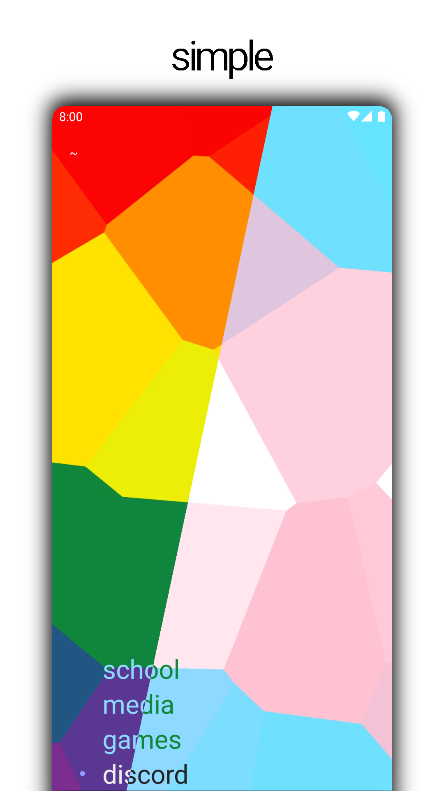
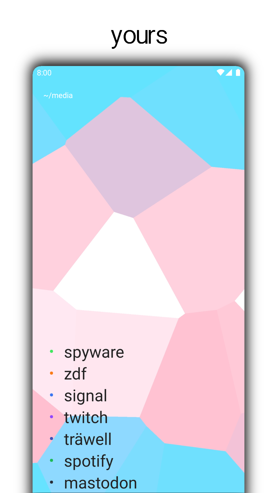
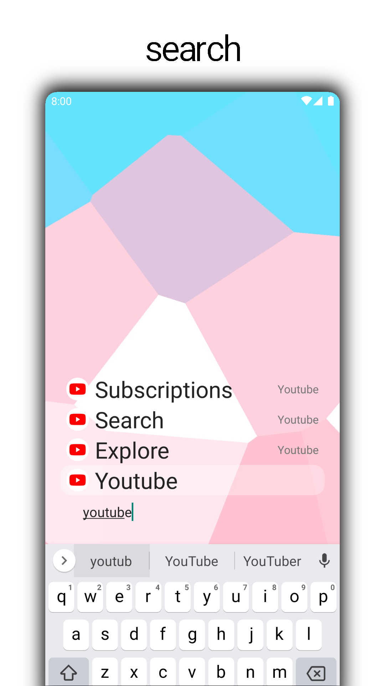
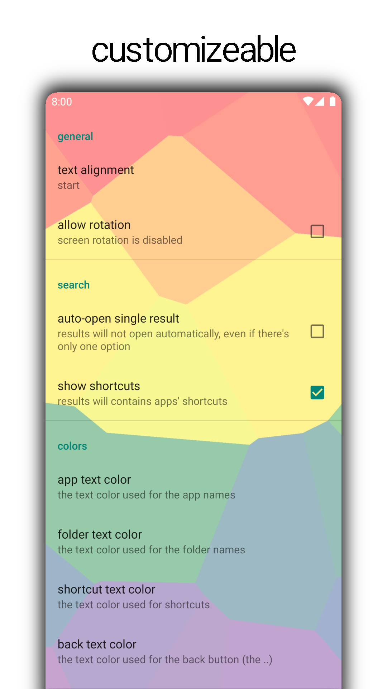

# folder launcher
The folder launcher is a minimalist, privacy respecting, linux-like file system inspired, android launcher. No tracking, no bloat.

## Features
- **File System like Structure** - Organize apps and widgets like files in a file system
- **Private** - No internet, No tracking
- **Customizable UI** - Edit names, colors, icons, widgets
- **Quick Search with Dots** - Search for apps, folders, Dots and shortcuts

## Usage
The launcher editing UI is still rather unintuitive. This will get better in the future, if I ever get around to fixing it.

- Long press the background to
  - add files (apps), folders or widgets
  - open the settings
- Tap on an app or folder to
  - launch the app
  - view the folders contents
- Long press on an app or a folder to
  - move it
  - rename it
  - change its icon
- Swipe up for a simple seach bar. Use Dots.
- Swipe down to
  - close the search page
  - open the notifications/quick settings panel
- Add per folder widgets,
  - normal widgets, taking up as much space as needed
  - row widgets, rows with height defined as a percentage of the folder width, containing widgets whose widths are defined as percentages of the row's width
- Long press on a widget in edit mode to remove it

# Dots
The folder launcher's search bar has a system called Dots, inspired by the amazing [duckduckgo bangs](https://duckduckgo.com/bangs).
Dots let you quickly jump to specific actions or apps by typing a short prefix. There are three Dots right now:
- Browser (.b) - to search for a query on ddg or to open a URL in the default browser app
- Maps (.m) - to search for a query in the default Maps app
- Youtube (y) - to search for a query in the YouTube or the NewPipe app

For Example, typing ".b example.com" in the search bar opens *example.com* in your default browser.

